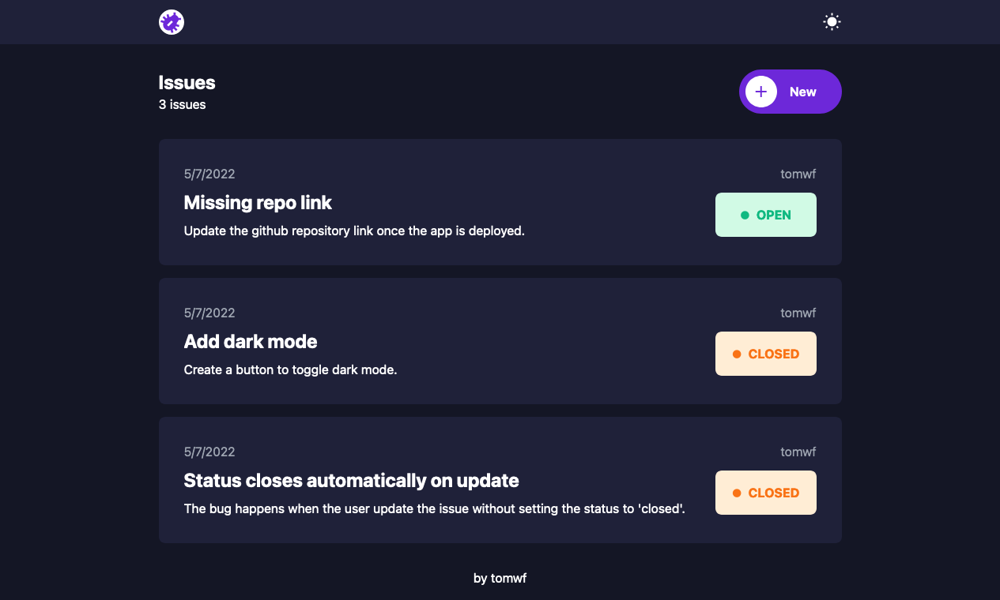

# Issue Tracker
A simple web app to track issues.


## How To Use
### Development
```bash
git clone https://github.com/tomwf/issue-tracker.git
```
Navigate into the directory:
```bash
cd issue-tracker
```
Install the dependencies:
```bash
npm i
```
Run the local dev environment:
```bash
npm start
```
Open your browser and visit:
```
http://localhost:3000
```

## Link
Live Demo: [Issue Tracker](https://tomwf-issue-tracker.herokuapp.com/)
